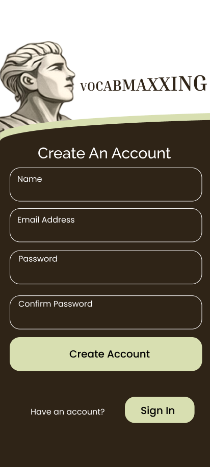
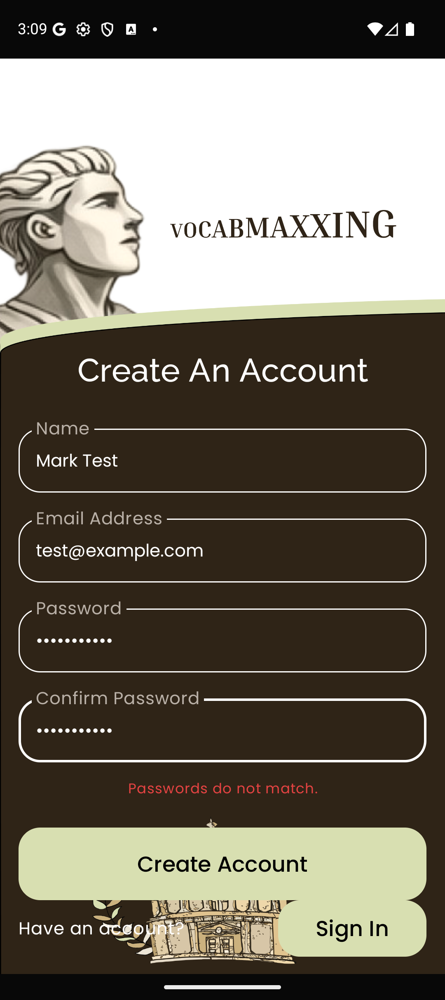
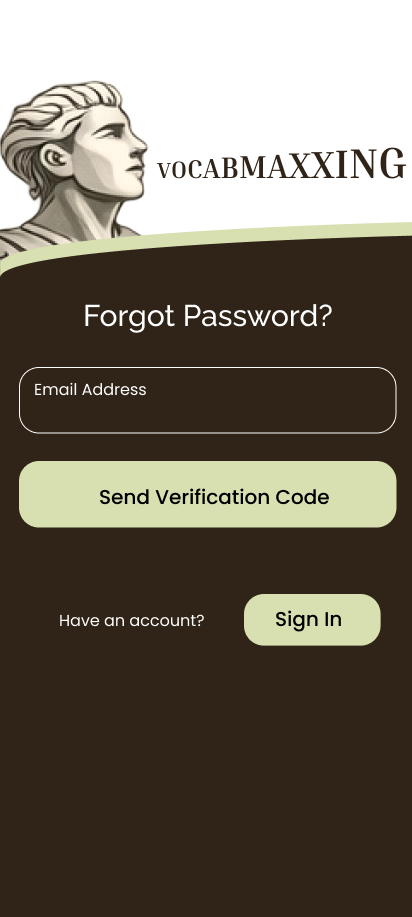
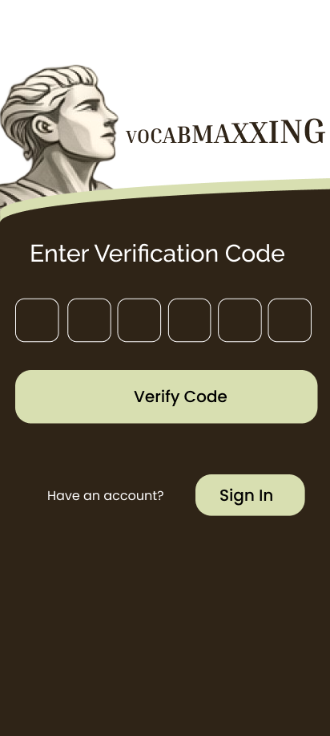

# Auth Screens — Design-Fidelity Audit Findings

**Branch:** `signup_page` · **Audited code:** commits `c92f2fe`, `f917aab`, `6195f26` (app source unchanged by the two later commits)
**Figma file:** `aealsPNZGof4CL82nXCGr8` (VocabMaxxing App) — frames re-pulled 2026-07-15, byte-identical to June 2026 captures (zero design drift)
**Method:** static code⇄Figma comparison (Mac session, 2026-07-15) + runtime audit on Pixel 9a AVD, Android 16, 1080×2424 @ 420 dpi ≈ **411×923 dp** (design frame: 412×917) — near-1:1 scale
**Scope:** report only. No source changes, no commits. Screenshots in [`docs/auth-audit/`](auth-audit/).

---

## 1. Executive summary

All five auth screens are **high-fidelity implementations of their wireframes**. Typography (Raleway headings / Poppins body / Inria Serif wordmark asset), colors (olive `#D8DFB1` CTAs, `#2F2417` field fill, white borders, `#9CB8C4` links), component dimensions, content and element order all match the Figma frames. Navigation, validation gating, keyboard types, and the intentionally-stubbed recovery flow all behave correctly.

Two genuine visual deviations lead the fix list:

1. **F1 — the dome/laurels footer renders on all five screens; Figma has it only on Sign In.** On Sign Up this is not just extra chrome: the bottom row ("Have an account?" + Sign In pill) **visibly collides with the dome artwork**, and error states make the collision worse.
2. **F2 — field labels:** Figma shows static white labels top-anchored inside the pill; the app uses muted `#B8AFA6` Material-style floating labels (centered when empty, floating up over the border when focused/filled).

Everything else is a note or an intentional deviation (§5).

| Screen (Figma node) | Fidelity verdict | Runtime issues |
|---|---|---|
| Sign In `242-2808` | **Faithful** (verified on Mac + PC devices) | Error state pushes bottom row into dome (R2) |
| Sign Up `200-30` | **Faithful, with layout defect** | Dome shouldn't exist (F1) **and** bottom row collides with it (R1); F2 labels |
| Forgot Password `202-88` | **Faithful** | Dome shouldn't exist (F1); F2 label |
| Verification Code `281-30` | **Faithful** | Dome shouldn't exist (F1) |
| Reset Password `283-1327` | **Faithful** | Dome shouldn't exist (F1); F2 labels; error state crowds Sign In pill against CTA (R2) |

---

## 2. Side-by-side screenshots

Device captures are full-screen (status bar included); Figma frames are 412×917.

| Screen | Figma reference | Device (clean) | Device (state) |
|---|---|---|---|
| Sign In |  |  |  auth error |
| Sign Up |  |  |  mismatch |
| Forgot Password |  |  | — |
| Verification Code |  |  |  filled |
| Reset Password |  |  |  mismatch |

Additional state captures: [signup match (error cleared)](auth-audit/device_02_signup_match.png) · [signup email keyboard + floating labels](auth-audit/device_02_signup_kbd_email.png) · [password masking](auth-audit/device_02_signup_kbd_pw.png) · [OTP numeric keypad](auth-audit/device_04_verify_kbd.png) · [OTP 5-digit (CTA inert)](auth-audit/device_04_verify_5digits.png) · [reset match](auth-audit/device_05_reset_match.png) · [return to Sign In after Reset](auth-audit/device_05_reset_after_cta.png)

---

## 3. Comparison matrix (all screens)

Confirmed matches from the static pass, spot-verified at runtime:

| Element | Figma | Code | Verdict | Severity |
|---|---|---|---|---|
| Headings | Raleway Medium 30, white | Raleway Medium 30sp, white | ✅ match | — |
| Field labels & helper/link text | Poppins Regular 16, **white, top-anchored in box** | Poppins Regular 16sp, **`#B8AFA6`, M3 floating-label** | ⚠️ mismatch | **F2 (minor)** |
| Button text | Poppins Medium 20, black | Poppins Medium 20sp, black | ✅ match | — |
| Wordmark | Inria Serif Bold 22→44px ascending | exported PNG asset, h=35dp | ✅ match | — |
| CTA / small-button fill | `#D8DFB1` | `SignInOlive #D8DFB1` | ✅ match | — |
| Field fill / border | `#2F2417` / 1px white | `#2F2417` / 1dp white | ✅ match | — |
| Link color | `#9CB8C4` | `SignInLinkBlue` | ✅ match | — |
| Pill fields | 377.5×66.5, r20 | full-width, 67dp, r20 | ✅ match | — |
| Small Sign In/up button | 136.6×51.6, r20 | 137×52dp, r20 | ✅ match | — |
| OTP cells | 54.5 sq, r11.7, 0.97px border | 54.5dp, r11.7dp, 1dp border | ✅ match | — |
| Statue / wordmark placement | (-31, 55) 182×257 / h35 | offset(-31,55) 182×257 / h35 | ✅ match | — |
| **Dome/laurels footer** | **Sign In frame only** (node `242:4085`) | `AuthScaffold` draws it on **all 5 screens** | ❌ mismatch | **F1 (medium-low; medium on Sign Up — see R1)** |
| Titles/labels/strings & element order | (per frame) | identical incl. curly apostrophe, "Sign in" vs "Sign In" casing per frame | ✅ match | — |
| Vertical rhythm | absolute Y, irregular gaps 13.5–34.8px | `SpaceBetween` + fixed 16/24/28dp spacers | ≈ equivalent | F3 (note) |
| Bottom-row Y position | varies per frame (y≈591–779) | uniform anchor (SpaceBetween + 160dp dome clearance) | ≈ equivalent | F4 (note) |
| OTP cell gaps | irregular 7.8–10.7px (hand-placed) | uniform ~10.2dp | code arguably more correct | F5 (note) |
| Horizontal margins | x=19 left, ~15.5 right (asymmetric) | symmetric 17dp | ≈ equivalent | F6 (trivial) |

---

## 4. Runtime findings (new this session)

- **R1 (medium) — Sign Up bottom row collides with the dome artwork.** With four fields + CTA, the column's bottom row lands inside the dome's 160dp clearance zone: "Have an account?" is drawn across the laurel/dome art and the dome's top edge is clipped behind the CTA ([clean](auth-audit/device_02_signup.png), [worse with error text](auth-audit/device_02_signup_mismatch.png)). Fixing F1 (remove dome from non-Sign-In screens, per Figma) makes this disappear for free — one more reason F1 leads the fix list.
- **R2 (minor) — error states crowd the footer.** The additive error text pushes content down: on Sign In the bottom row then overlaps the dome ([capture](auth-audit/device_01_signin_error.png)); on Reset the Sign In pill sits flush against the CTA ([capture](auth-audit/device_05_reset_mismatch.png)). Wireframes don't model error states, so this is a layout-robustness note, not a fidelity bug.
- **R3 (note) — disabled CTAs have no visual affordance.** A gated (disabled) CTA renders identical full-olive to an enabled one. Functionally correct (taps are inert), but users get no cue. Figma shows no states either, so this is a designer question, not a mismatch.
- **R4 (note) — OTP burst input keeps the *last* 6 digits.** The guard at `AuthComponents.kt:278` rejects any update >6 chars, so keystroke-by-keystroke input correctly ignores a 7th digit. But paste-like burst input (observed with adb-injected text) desyncs the IME buffer and the field ends up with the last 6 digits typed rather than the first 6. Edge case; only matters if users paste codes.
- **R5 (note, unconfirmed severity) — on Sign Up, the Confirm Password field can sit behind the open keyboard.** While typing in Password with the IME up, Confirm Password was underneath the keyboard; taps at its position landed on keyboard keys. Whether the column scrolls with the IME open was not verified — worth a quick manual check on a physical device.

---

## 5. Functional checks (Step 5) — all pass

| Check | Result |
|---|---|
| Sign In → Sign up → back (small button and system back) | ✅ returns to Sign In |
| Sign In → Forgot → Verify → Reset → "Reset Password" | ✅ full chain works; Reset returns to Sign In (`popUpTo auth`) |
| Small "Sign In" button from recovery screens | ✅ verified from Sign Up and Forgot (identical nav lambda on Verify/Reset in `MainActivity.kt`) |
| Unauthenticated user not bounced off auth-flow routes | ✅ sat on all 4 routes for minutes; `authFlowRoutes` guard (`MainActivity.kt:29`) holds |
| Authenticated session forwards to `daily` | ✅ observed — a stale test session on the AVD skipped straight to the main app until data was cleared |
| Sign Up CTA gating (all fields + match) | ✅ mismatch → red "Passwords do not match." + inert CTA + **zero** Firebase/network in logcat. Matching passwords clear the error. *The enabled CTA was deliberately not tapped — it would create a real account in the pilot Firebase project; the enable condition was verified statically.* |
| OTP behavior | ✅ numeric keypad; letters rejected; hard cap 6 visible; backspace edits; "Verify Code" inert at 5 digits, advances at exactly 6 (see R4 for burst-input nuance) |
| Keyboard types | ✅ email layout (`@` key) on email fields; masking (dots) on all password fields; numeric keypad on OTP |
| Recovery-flow stubs fire no network | ✅ logcat silent (no firebase/okhttp/http lines) across Send Verification Code, Verify Code, Reset Password |
| Sign In calls Firebase by design | ✅ `FirebaseAuth: Logging in as …` in logcat; graceful red error on bad credentials |

---

## 6. Intentional deviations (NOT bugs — do not "fix")

- Single-spaced "Reset Password" CTA (Figma has a double space — typo in the design).
- Error texts ("Passwords do not match.", Firebase auth errors; 13sp Poppins red) and the "Processing..." loading label — additive states absent from the wireframes.
- CTA enable/disable gating (wireframes are stateless).
- OTP digit glyphs (Poppins Medium 22sp white) — design shows only empty boxes.
- Name field is captured in UI but not sent to the backend.
- The entire forgot/verify/reset flow is UI-stubbed by decision (2026-06-24): the pilot uses Firebase's link-based `sendPasswordResetEmail`; the 6-digit code flow is deferred post-pilot.

---

## 7. Prioritized fix list

1. **F1 / R1 — dome on non-Sign-In screens** (`AuthScaffold` draws it unconditionally). Per Figma it belongs on Sign In only; removing it elsewhere also fixes the Sign Up collision (R1). *Confirm intent with Alesandra first — if the dome is wanted as universal chrome, then instead fix the Sign Up bottom-row collision.*
2. **F2 — field labels**: white + top-anchored static labels per Figma vs. current muted floating labels. Designer call: the M3 float behavior is arguably better UX; either update the code or the wireframes.
3. **R2 — reserve space for error text** so error states don't shove the footer into the artwork (e.g., fixed-height error slot).
4. **R3–R5** — nice-to-haves: disabled-CTA affordance, OTP paste behavior, keyboard-vs-Confirm-field check on hardware.

## 8. Repo hygiene (F7)

- `fonts_originals/` (46 unused .ttf, ~7 MB) committed at repo root in `c92f2fe` — cleanup candidate.
- `server/bin/` (Gradle build output) was **committed in `f4207fc`** — note the commit is labeled "new files: auditing tests for signup pages" but actually contains 17 server build-output files (~1,769 lines) and no tests. Candidate for `git rm -r --cached server/bin` + a `.gitignore` entry.

---

*Audit run 2026-07-15 on Mark's PC (Windows 11). Emulator note for reproduction: the Pixel 9a AVD wedged at `adb devices: offline` with the default GPU — same failure as the Mac session; launching with `-gpu swiftshader_indirect` boots cleanly in ~60 s.*
